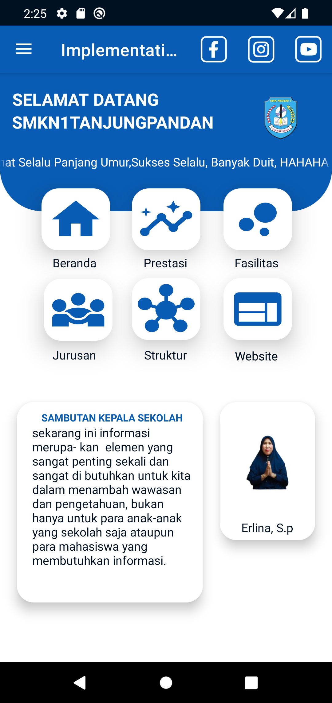
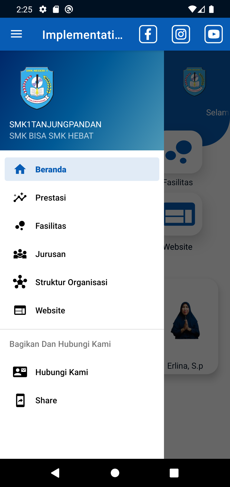
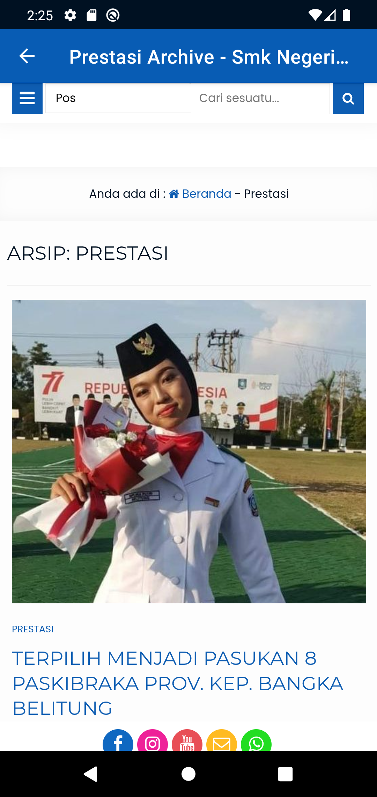
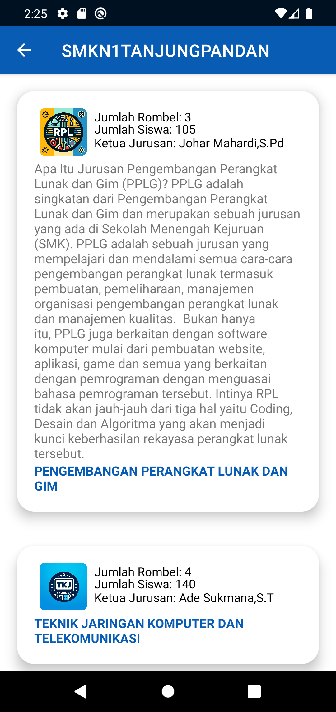
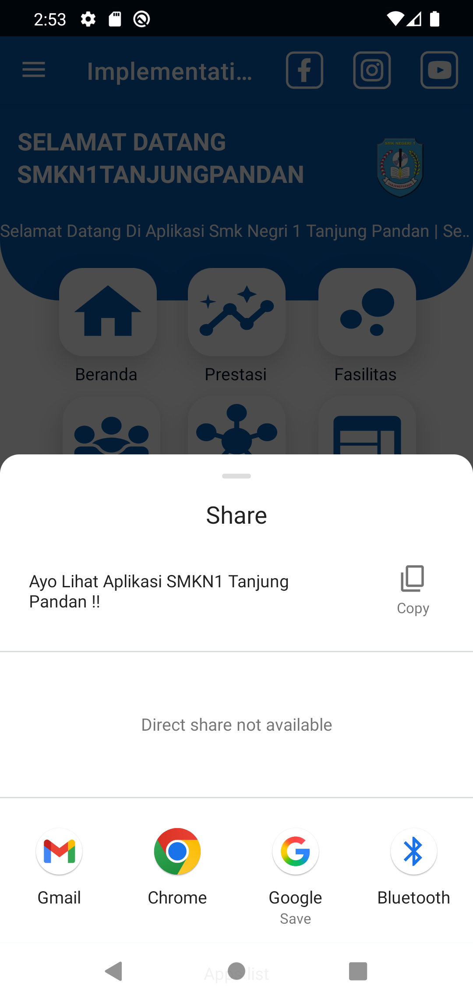

# 🏫 Company Profile App

**Company Profile App** is a native Android application designed to serve as a mobile portal for SMKN 1 Tanjung Pandan, a vocational high school in Indonesia. The app combines native Android UI components with embedded web content to deliver a complete institutional profile experience, including academic programs, achievements, facilities, and organizational structure.

---

## 🚀 Overview

This document provides a comprehensive overview of the Company Profile Android application, which serves as a mobile portal for SMK N1 Tanjung Pandan, a vocational school in Indonesia. The application combines native Android UI components with web-based content to deliver a comprehensive institutional profile including academic programs, achievements, facilities, and organizational information.

This overview covers:
- Core navigation system
- Primary content modules

> 📌 For detailed architectural patterns, see Application Architecture.  
> 📌 For UI design and layout patterns, see User Interface Design.

---

## 📱 Features

- 🏫 **School Profile:** Displaying school history, vision & mission, and general information
- 🎓 **Academic Programs:** Listing vocational majors and their descriptions
- 🏆 **Achievements:** Showcasing awards and recognitions by students and staff
- 🏗️ **Facilities:** Presenting school infrastructure, labs, classrooms, etc.
- 👥 **Organizational Structure:** Displaying staff hierarchy and departments
- 🌐 **Web Integration:** Embedding external school web pages using WebView

---

## 🧩 Architecture

The application follows a modular and scalable structure:

- **Modular Design:** Each feature is organized into separate modules
- **Native UI:** Built using Android's native tools (XML, Jetpack)
- **WebView Support:** External content is embedded through WebView
- **Offline Support:** Static content can be accessed without internet connection

---

## ⚙️ Tech Stack

| Tech             | Usage                                         |
|------------------|-----------------------------------------------|
| Java/Kotlin      | Core programming language                     |
| Android XML      | Designing UI layouts                          |
| WebView/HTML     | Embedding web-based content                   |

---

## 🧑‍💻 Core Modules

| Module               | Description                                                  |
|----------------------|--------------------------------------------------------------|
| Home Page            | Landing screen with school introduction                      |
| School Profile       | Displays school's background and vision-mission              |
| Academic Programs    | Lists all available majors with details                      |
| Achievements         | Gallery of awards and competition highlights                 |
| Facilities           | Visual overview of school infrastructure                     |
| Organization         | Shows school’s staff and leadership hierarchy                |

---

## 🗺️ User Journey

1. User opens the app and lands on the home screen
2. User browses through the school profile and available majors
3. User views school achievements and activities
4. User explores facilities through text and images
5. User checks the organizational structure
6. User navigates to the embedded official website if needed
7. User exits or returns to the home screen

---

<h3>Home Page & Drawer </h3> <p align="center">  &nbsp;  </p> 

---

<h4>WebView Page, Major Page & Share Popup </h4> <p 
<p align="center">
  
  &nbsp;
  
  &nbsp;
  
</p>
---

## 🛠️ How to Run

```bash
# Clone the repository
git clone https://github.com/your-username/SMKN1CompanyProfile.git

# Open with Android Studio
# Build and run on emulator or physical device

```
## 📬 Contact Developer
If you encounter any issues or want to contribute, feel free to reach out:
📩 zibranaby069@gmail.com